# Blueprint Usage

This page shows the Blueprint workflow for Config Toolkit. Start with the setup section before using the read and write nodes.

## Install And Setup

1. Copy or keep the plugin at:

```text
YourProject/Plugins/ConfigToolkit
```

2. Open the Unreal project.
3. Go to `Edit > Plugins`.
4. Search for `Config Toolkit`.
5. Enable the plugin.
6. Restart the editor if Unreal asks.
7. Open `Edit > Project Settings > Plugins > Config Toolkit`.
8. Configure the plugin settings.
9. For Unreal Engine 5.4 and newer, allow generated config sections to be saved. Add this to the project config file that owns the generated config you want to write, commonly `Config/DefaultGame.ini` when using `Game.ini`:

```ini
[SectionsToSave]
bCanSaveAllSections=true
```

Without this setting, Unreal can block saving sections in generated configs such as `Game.ini` or `Engine.ini`.


Recommended starting setup:

| Setting | Recommended value | Why |
| --- | --- | --- |
| `Default Config File Name` | `Game` or your own config name | Used when a node's `File Name` pin is empty. |
| `Automatically Flush Config` | Enabled while learning, disabled for batched writes | Enabled writes to disk immediately. Disabled lets you call `Flush Config` manually after several writes. |
| `Automatically Handle Soft Reference Paths` | Enabled | Lets Soft Object Reference and Soft Class Reference pins save/read path strings without loading assets or classes. |
| `AES Encryption Key` | Empty unless encryption is needed | Required only for encrypted string nodes. If used, it must be exactly 32 UTF-8 bytes. |

## File Name Behavior

Most nodes have a `File Name` pin.

| File Name pin | Result |
| --- | --- |
| Empty | Uses `Default Config File Name` from project settings. |
| `Game` | Uses Unreal's resolved generated `Game.ini`. |
| `MyConfig` | Uses Unreal's resolved generated `MyConfig.ini`. |
| Absolute path ending in `.ini` | Uses that exact disk file. |

Generated config files usually appear under:

```text
Saved/Config/WindowsEditor/
```

Packaged Windows builds usually use:

```text
Saved/Config/Windows/
```

## Write One Value

Use `Write Config Value` to save one Blueprint value.

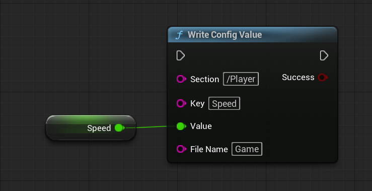

Example:

```text
Section: Player
Key: Speed
Value: 600.0
File Name: Game
```

Expected `.ini` output:

```ini
[Player]
Speed=600.0
```

The value pin is a wildcard pin. Connect the actual type you want to save, such as `Float`, `Bool`, `Name`, `String`, `Vector`, `Rotator`, `Soft Object Reference`, or `Soft Class Reference`.

## Read One Value

Use `Read Config Value` to read one value back.

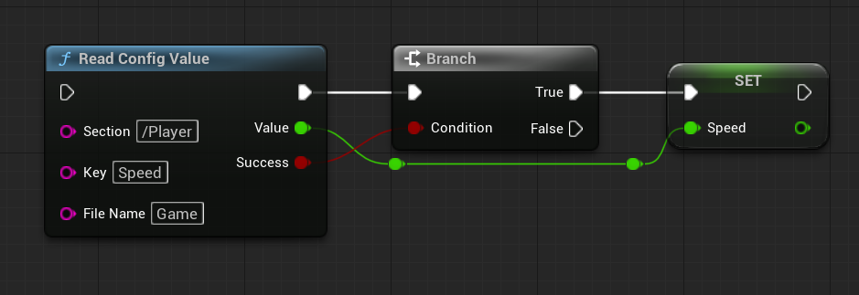

Recommended flow:

1. Create `Read Config Value`.
2. Connect or promote the `Value` output as the type you expect.
3. Branch on `Success`.
4. Use the value only when `Success` is true.

If the saved text cannot be imported into the output pin type, the node returns false and logs the reason under `LogConfigToolkit`.

## Write Arrays

Use `Write Config Array` to save a Blueprint array using Unreal's native config array format.

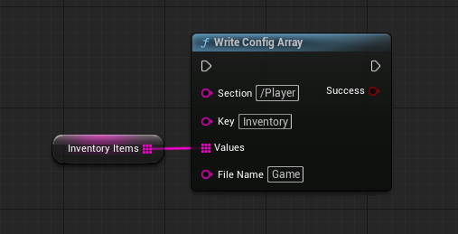

Example output:

```ini
[Inventory]
Items=Sword
Items=Shield
Items=Potion
```

The plugin stores repeated config keys, not JSON. Unreal default config merge files often use `+Items=Value`, but generated saved config files commonly appear as repeated `Items=Value` lines.

## Read Arrays

Use `Read Config Array` to read native config array entries back into an array output.

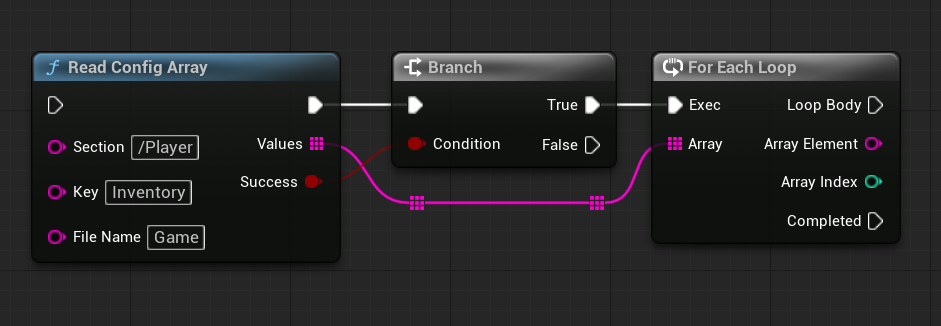

Connect the `Values` output to a `Set` node, `For Each Loop`, or another array node.

Unreal config arrays do not have a native explicit empty-array marker in this plugin's format. If you write an empty array, a later read can return false because there are no `+Key=Value` entries to import.

## Add Unique To Array

Use `Add Unique To Config Array` to add one value only when the serialized value is not already present.

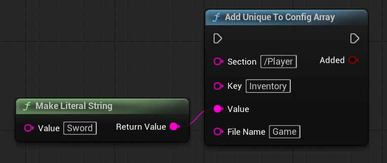

Returns:

| Result | Meaning |
| --- | --- |
| `true` | The value was added. |
| `false` | The value already existed or the operation failed. Check `LogConfigToolkit` for details. |

## Remove From Array

Use `Remove From Config Array` to remove matching values from a config array.

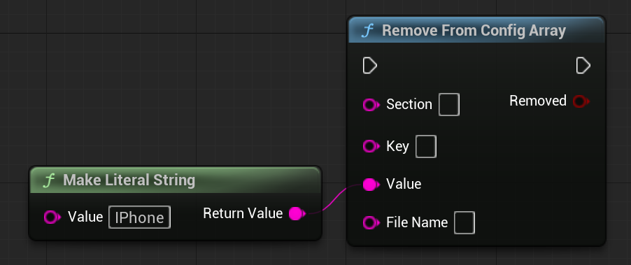

Returns:

| Result | Meaning |
| --- | --- |
| `true` | At least one matching value was removed. |
| `false` | No matching value was found or the operation failed. |

## Soft Object References

Soft references are the safe workflow for asset config values. Config Toolkit stores the asset path string, but it returns a `Soft Object Reference` pin instead of loading the asset.

Use this when `Automatically Handle Soft Reference Paths` is enabled:

1. Connect a `Soft Object Reference` variable to `Write Config Value`.
2. Config Toolkit writes the soft path string.
3. Read it back into a `Soft Object Reference` output pin.
4. Use Unreal's native `Async Load Asset` node when you actually need the loaded object.

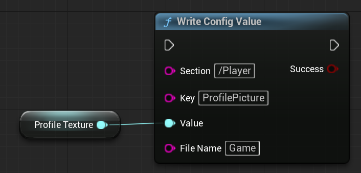

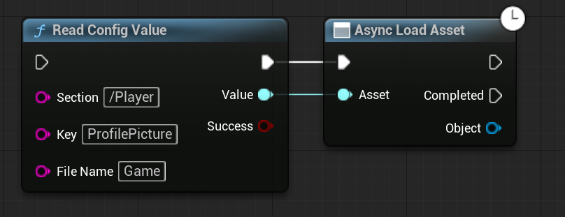

Important behavior:

- Reading into a `Soft Object Reference` pin succeeds without loading the asset.
- Writing a hard object reference can save its existing path because the object is already loaded.
- Reading into a hard object reference pin fails by design because that would require synchronous loading.
- `String` pins are preserved as raw strings. The plugin does not inspect strings and guess whether they are asset paths.

## Soft Class References

Soft class config values work the same way as soft object values.

Use this when `Automatically Handle Soft Reference Paths` is enabled:

1. Connect a `Soft Class Reference` variable to `Write Config Value`.
2. Config Toolkit writes the class path string.
3. Read it back into a `Soft Class Reference` output pin.
4. Use Unreal's async loading workflow before using the loaded class.

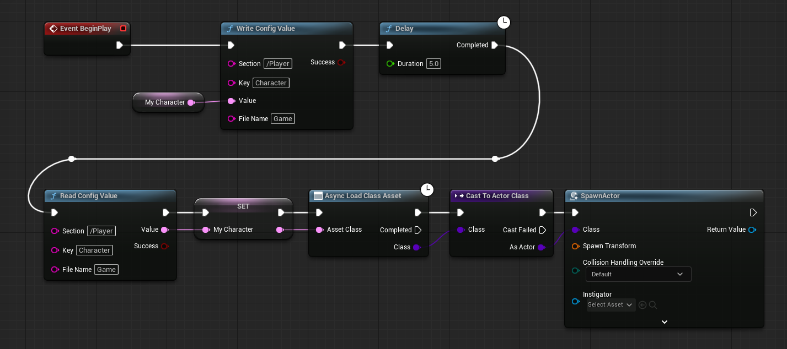

Hard class reads fail by design. Read into a soft class reference, then load asynchronously.

## Manual Asset And Class Conversion

If you disable `Automatically Handle Soft Reference Paths`, or if you prefer explicit conversion nodes, use the manual pure helpers.

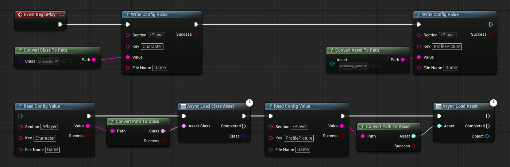

Available helpers:

| Node | Use |
| --- | --- |
| `Convert Asset To Path` | Converts an already available asset reference into a soft object path string. |
| `Convert Class To Path` | Converts an already available class reference into a soft class path string. |
| `Convert Path To Asset` | Converts a path string into a Soft Object Reference and returns `Success`. It does not load the asset. |
| `Convert Path To Class` | Converts a path string into a Soft Class Reference and returns `Success`. It does not load the class. |

Use the `Success` bool before using the converted soft reference.

## Encrypted Strings

Use `Write Encrypted String` and `Read Encrypted String` for encrypted string values.

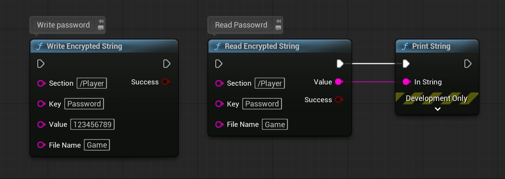

Setup rules:

- Set `AES Encryption Key` in project settings.
- The key must be exactly 32 UTF-8 bytes.
- Only the value is encrypted. The file name, section name, and key name remain readable in the `.ini` file.

## Check Files And Keys

Use `Does Config File Exist` to check whether the resolved `.ini` exists on disk.

Use `Does Config Key Exist` to check for a key.

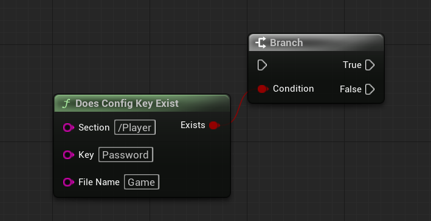

`Does Config Key Exist` behavior:

| Section pin | Behavior |
| --- | --- |
| Non-empty | Checks only that section. |
| Empty | Searches every section in the file for the key. |

## Remove Keys, Sections, And Files

Use these nodes for cleanup:

| Node | Use |
| --- | --- |
| `Clear Config Key` | Removes one key from one section. |
| `Clear Config Section` | Removes a whole section and its keys. |
| `Remove Config Section` | Also removes a whole section and its keys. Use this clearer name for new graphs. |
| `Delete Config File` | Deletes the resolved `.ini` file and clears cached config data so stale memory does not recreate it later. |

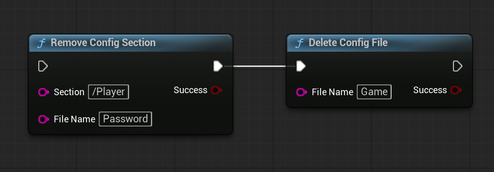

Section removal and key removal respect `Automatically Flush Config`. If automatic flush is disabled, call `Flush Config` when you want the deletion written to disk.

`Delete Config File` deletes the disk file directly. It returns false if the file cannot be resolved, cannot be deleted, or does not exist.

## Manual Flush Workflow

If `Automatically Flush Config` is disabled, write and cleanup nodes update the config cache first. Call `Flush Config` when you want the current cached config state written to disk.

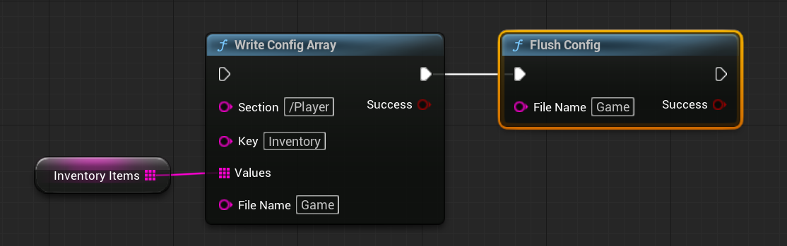

Recommended batched-write flow:

1. Disable `Automatically Flush Config`.
2. Run several write, remove, or clear nodes.
3. Call `Flush Config` once for the same file.
4. Check the `Success` output.

## Get Sections

Use `Get Config Sections` to list all section names from a config file.

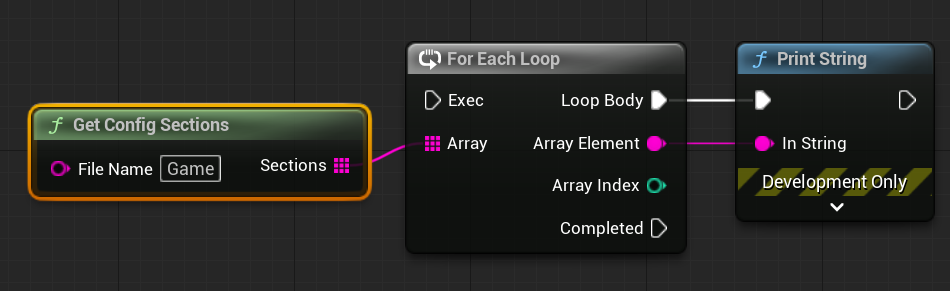

This is useful for debug menus, user profile lists, and validation tools.
