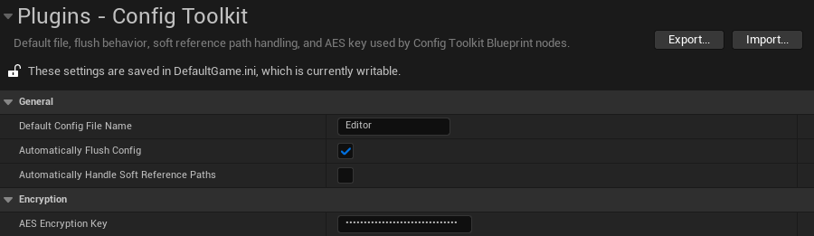

# Settings

Open settings here:

```text
Project Settings > Plugins > Config Toolkit
```


These settings control the Blueprint nodes globally.

## Required Unreal Config Setup

For Unreal Engine 5.4 and newer, generated config files such as `Game.ini` and `Engine.ini` may not save arbitrary sections unless the owning default config allows it.

When using the default `Game` config, add this to your project's `Config/DefaultGame.ini`:

```ini
[SectionsToSave]
bCanSaveAllSections=true
```

For another generated config, add the same block to the matching default config file that owns it.

If this block is missing, Blueprint writes can update Unreal's in-memory config cache but fail to persist the section to disk.

## Default Config File Name

Default:

```text
Editor
```

Used when a Blueprint node receives an empty `File Name` pin.

Examples:

| Setting value | Result |
| --- | --- |
| `Editor` | Uses Unreal's generated `Editor.ini`. |
| `MyConfig` | Uses Unreal's generated `MyConfig.ini`. |
| empty | Reset to `Game` by the settings object. |

Generated config files are platform-specific. Common Windows editor output:

```text
Saved/Config/WindowsEditor/
```

Common packaged Windows output:

```text
Saved/Config/Windows/
```

## Automatically Flush Config

Default:

```text
Enabled
```

When enabled, operations that change config data flush through Unreal's config system after the change.

Affected nodes:

- `Write Config Value`
- `Write Config Array`
- `Add Unique To Config Array`
- `Remove From Config Array`
- `Write Encrypted String`
- `Clear Config Key`
- `Clear Config Section`
- `Remove Config Section`

When disabled, these nodes update Unreal's in-memory config cache only. Call `Flush Config` when you want to write changes to disk.

Recommended setup:

- Enable it for simple Blueprint usage and debugging.
- Disable it when writing many values in a row, then call `Flush Config` once at the end.

## Automatically Handle Soft Reference Paths

Default:

```text
Enabled
```

When enabled, wildcard read/write nodes automatically handle these pin types:

- `Soft Object Reference`
- `Soft Class Reference`
- arrays of `Soft Object Reference`
- arrays of `Soft Class Reference`

Write behavior:

- A Soft Object Reference pin is saved as a soft object path string.
- A Soft Class Reference pin is saved as a soft class path string.
- A hard Object Reference or Class Reference pin can also be written because the referenced object/class is already loaded; it is saved as a soft path.

Read behavior:

- A saved path can be read into a Soft Object Reference pin.
- A saved path can be read into a Soft Class Reference pin.
- Reading into a hard Object Reference or hard Class Reference pin fails by design because that would require synchronous loading.

When disabled, wildcard read/write nodes do not automatically handle soft reference paths. Use the manual conversion nodes instead:

- `Convert Asset To Path`
- `Convert Class To Path`
- `Convert Path To Asset`
- `Convert Path To Class`

## AES Encryption Key

Used by:

- `Write Encrypted String`
- `Read Encrypted String`

Requirements:

- Exactly 32 characters.
- Exactly 32 UTF-8 bytes.

Valid ASCII example:

```text
12345678901234567890123456789012
```

Only the value is encrypted. The config file name, section name, and key name remain readable.
